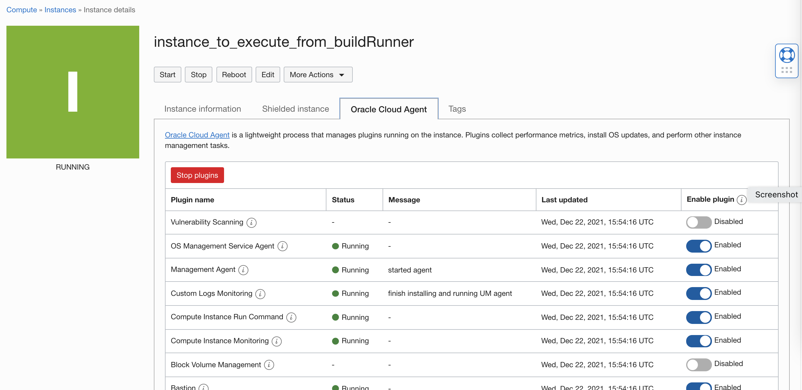
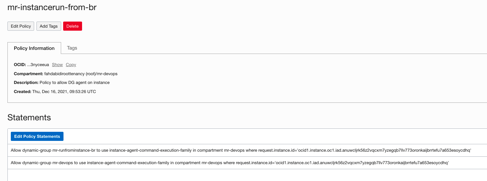
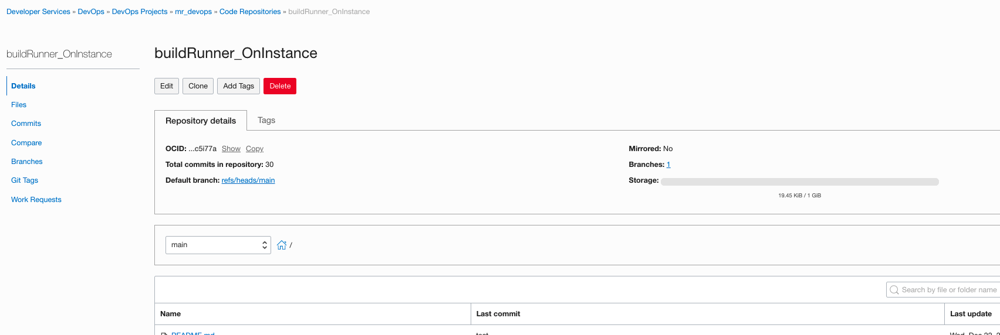

Sample Illustration of executing commands on an instance (public or private) using OCI Cloud Instance Agent

------

Objective

--------

- The objective of this illustration to explain how you can run a command on an instance from OCI build runner and fetch the outputs.

- Leveraging OCI CLI for the execution and interaction with object storage.

- Tested this using private and public subneted OCI instances 


The flow ..

VCN

----

Validate the VCN & Ensure you have the right subnet (It can be private or public)


Compute Instance

-----

- Create the instance using the desired subnet.
- Ensure to enable Oracle cloud agent via console or CLI.
- Ensure 'Compute Instance Run Command' agent is running.



- Use appropriate procedure if you are using a private subnet instance which does not have an access to public yum repos. Ref -  https://docs.oracle.com/en-us/iaas/Content/Compute/Tasks/manage-plugins.htm#manage-plugins 

- Create a user group for agent run and add the OCI user/users who is /are allowed for executions.


- Create a dynamic group and add the necessary instances IDs to the DG.



Devops Build pipeline

----

- Create a build pipeline & Devops code repo - https://docs.oracle.com/en-us/iaas/Content/devops/using/home.htm

- Create a DG by adding resource as devops build pipeline.


- Create a policy for allowing buildpipeline to use instance agent.


- Clone this repo and push the code to the OCI Devops Repo created (using GIT commands)

```
$ git clone https://github.com/RahulMR42/OCI-ExecuteCommands-FromBuildRunner-UsingComputeAgent
$ cd OCI-ExecuteCommands-FromBuildRunner-UsingComputeAgent
$ git remote add ocirepo <OCI Repo GIT URL>
$ git push ocirepo main (provide the credentials when prompted)
```

- Validate the OCI Devops code repo.




- Add a build stage  to the previously created build piple with type as managed build step.

- Use the Code repo as the primary source.


- Create a devops trigger connecting the code repo and build the pipeline.


Object Storage

----
- Create an object storage bucket (Let it be private).

Configurations

----

Now that we have the OCI infra ready ,do add some configurations.

### Build pipeline variables 
Setup below values as paramter for Build pipline.


- The Paramter INSTANCE_OCID is an optional one for build pipeline paramter refer next section for more.

### Update Localy Cloned repo.

- Go to the cloned repo (local ) update the content.json with object storage informations.

- Update sample_command_input_for_agent.txt file with the commands (Line by line).

- Incase of not sure about the object storage URI ,upload a dummy file and copy the URI to the content.json

- The Paramter INSTANCE_OCID is an optional one for build pipeline paramter ,if not provided there you need to add a json file named instances.json to your local copy and update the content as below .

```
{"instanceId": "OCI of the instance"}
```

- Push the changes to OCI Code repo (Using git commands)

- As the trigger is setup the build pipline will invoke and you can refer the command output via the object storage content or as displayed in the build run messages.

Object storage .


Build stage steps.


Sample command output


References 

------

- https://docs.oracle.com/en-us/iaas/Content/Compute/Tasks/manage-plugins.htm#manage-plugins

- https://docs.oracle.com/en-us/iaas/Content/Compute/Tasks/runningcommands.htm#runningcommands 

- https://docs.oracle.com/en-us/iaas/tools/oci-cli/2.15.0/oci_cli_docs/cmdref/instance-agent.html 


 


